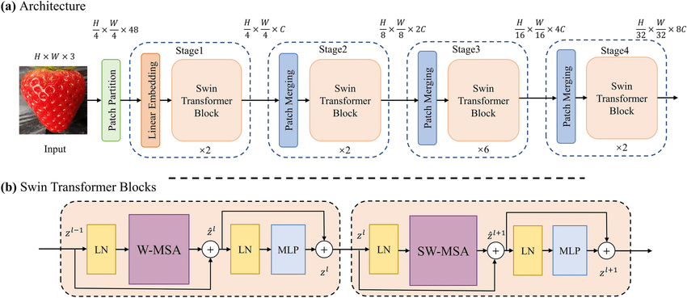

# 🪟 Swin Transformer: Hierarchical Vision Transformer for MNIST

Welcome to the Swin Transformer playground!  
This repo contains a **from-scratch PyTorch implementation of the Swin Transformer architecture** and a notebook showing how to train it for MNIST digit classification.  
Swin Transformer is a breakthrough in vision transformers, using shifted windows and hierarchical feature extraction for scalable, efficient image understanding.

---

## 📦 Folder Structure

```
Swin-Transformer/
├── swin.py                # Swin Transformer model implementation
├── swin_t.ipynb           # Swin Transformer MNIST notebook
├── images/                # Architecture diagrams & visualizations
│   ├── swin_overview.png
│   ├── swin_window_attention.png
│   ├── swin_shifted_windows.png
│   └── ... (add more as needed)
└── README.md              # You're here!
```

---

## 🖼️ Swin Transformer Visuals

| Diagram                                               | Description                                                                                                  |
| ----------------------------------------------------- | ------------------------------------------------------------------------------------------------------------ |
|             | **Swin Transformer Architecture:** Shows the hierarchical stages, patch merging, and window attention.       |
|  | **Window-based Self-Attention:** Visualizes how attention is computed within local windows.                  |
|    | **Shifted Windows:** Demonstrates how windows are shifted between blocks to enable cross-window connections. |

---

## 🤔 What is Swin Transformer?

Swin Transformer (Liu et al., 2021) is a **hierarchical vision transformer** designed for scalable image modeling.  
Its key innovations:

- **Window-based Self-Attention:**

  - Instead of global attention, Swin computes self-attention within non-overlapping windows, making it efficient for large images.

- **Shifted Windows:**

  - Every other block, windows are shifted by half their size, allowing information to flow across window boundaries and improving modeling power.

- **Hierarchical Feature Maps:**

  - The model downsamples feature maps between stages (patch merging), similar to CNNs, enabling multi-scale representation.

- **Flexible & Scalable:**
  - Works for classification, detection, segmentation, and more.

---

## 🛠️ Implementation Details

- **CyclicShift:** Efficiently shifts windows for cross-window attention.
- **WindowAttention:** Computes self-attention within each window, with optional relative positional embeddings and masking for shifted windows.
- **PatchMerging:** Downsamples feature maps between stages, doubling channels.
- **StageModule:** Stacks Swin blocks (regular and shifted) for each stage.
- **SwinTransformer:** Four stages, each with its own depth, heads, and downscaling factor, ending with a classification head.

**Original Paper Reference:**  
Liu et al., 2021 — [Swin Transformer: Hierarchical Vision Transformer using Shifted Windows](https://arxiv.org/abs/2103.14030)

---

## 🏃‍♂️ Quickstart

**Install dependencies:**

```bash
pip install torch torchvision matplotlib einops numpy
```

**Try the Swin Transformer on MNIST:**

- See `swin_t.ipynb` for the full training notebook.
- Adapts Swin for MNIST by setting `channels=1`, `window_size=4`, and appropriate downscaling factors.
- Plots training loss and accuracy.

---

## 📊 Results

- **MNIST Classification:**
  - Swin Transformer achieves strong accuracy, showing its flexibility beyond large-scale vision tasks.
  - Training curves and validation accuracy are plotted in the notebook.

---

## 💬 Interactive Exploration

- Play with the number of layers, heads, or window size in `swin.py`.
- Visualize attention maps or feature maps (add images to `images/`).
- Try Swin on other datasets—CIFAR, Fashion MNIST, etc.

---

## 📚 References

- [Swin Transformer: Hierarchical Vision Transformer using Shifted Windows (Liu et al., 2021)](https://arxiv.org/abs/2103.14030)

---

## 🙌 Contributing & Feedback

Questions, suggestions, or want to add your own diagrams?  
Open an issue or pull request—everyone’s welcome!

---

**Happy windowing and classifying! 🪟🖼️**
