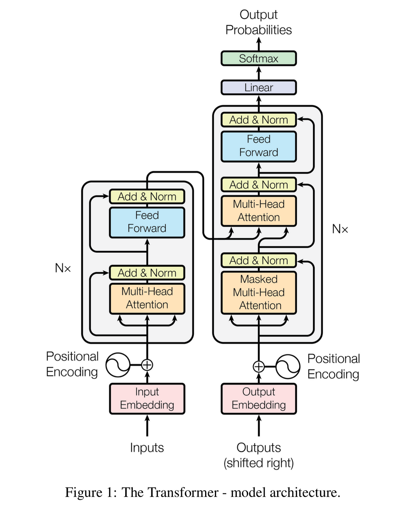
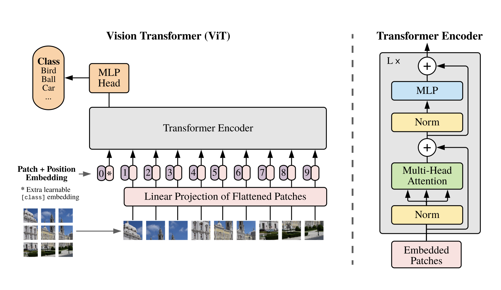
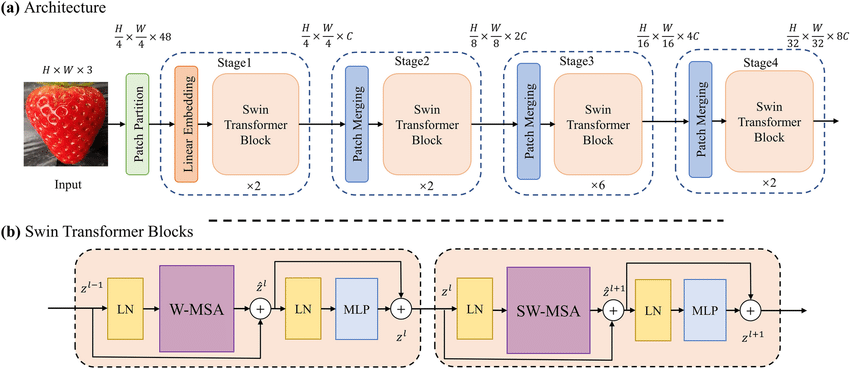

# 🧑‍🔬 Transformer Exercise Collection

Welcome to the **Transformer Exercise** suite!  
This folder brings together three powerful deep learning architectures—**UNet**, **Transformer (ViT & original)**, and **Swin Transformer**—each implemented from scratch in PyTorch and demonstrated on the MNIST dataset.  
Explore, learn, and experiment with modern vision and sequence models!

---

## 📦 Folder Structure

```
Exercise_Transformers/
├── transformer/           # Vision Transformer (ViT) & original Transformer
│   ├── Transformer.py
│   ├── vit.ipynb
│   ├── images/
│   └── README.md
├── unet/                  # UNet for segmentation & classification
│   ├── unet.py
│   ├── unet_msist.ipynb
│   ├── images/
│   └── README.md
├── Swin-Transformer/      # Swin Transformer for vision tasks
│   ├── swin.py
│   ├── swin_t.ipynb
│   ├── images/
│   └── README.md
└── README.md              # This file (top-level overview)
```

---

## 🖼️ Architecture Visuals

| Model              | Diagram Example                                                 | Description                                    |
| ------------------ | --------------------------------------------------------------- | ---------------------------------------------- |
| UNet               |                       | U-shaped encoder-decoder with skip connections |
| Transformer        |  | Encoder-decoder attention blocks               |
| Vision Transformer |               | Patch embedding for images                     |
| Swin Transformer   |               | Hierarchical, window-based attention           |

---

## 🚀 What’s Inside?

### **1. UNet**

- Classic biomedical segmentation architecture.
- Adapted for MNIST classification using global average pooling.
- Notebook: `unet/unet_msist.ipynb`

### **2. Transformer & Vision Transformer (ViT)**

- Original encoder-decoder transformer (as in "Attention is All You Need").
- Vision Transformer (ViT) for image classification.
- Notebooks and modular code for experimentation.
- Notebook: `transformer/vit.ipynb`

### **3. Swin Transformer**

- Hierarchical vision transformer using shifted windows.
- Efficient for large images, but adapted here for MNIST.
- Notebook: `Swin-Transformer/swin_t.ipynb`

---

## 🏃‍♂️ Quickstart

**Install dependencies:**

```bash
pip install torch torchvision matplotlib einops numpy
```

**Run any notebook:**

- Open the relevant `.ipynb` file in Jupyter or VS Code.
- Follow the cells to train, evaluate, and visualize results.

---

## 📊 Results

- All models achieve strong accuracy on MNIST.
- Training loss and validation accuracy are plotted in each notebook.
- Modular code makes it easy to extend for deeper models, more epochs, or other datasets.

---

## 💬 Interactive Exploration

- Change hyperparameters (layers, heads, window size, etc.) in each notebook.
- Add your own images to the `images/` folders for architecture and attention visualizations.
- Try these models on other datasets—Fashion MNIST, CIFAR, medical images, etc.

---

## 📚 References

- [U-Net: Convolutional Networks for Biomedical Image Segmentation](https://arxiv.org/abs/1505.04597)
- [Attention is All You Need](https://arxiv.org/abs/1706.03762)
- [An Image is Worth 16x16 Words: Transformers for Image Recognition at Scale](https://arxiv.org/abs/2010.11929)
- [Swin Transformer: Hierarchical Vision Transformer using Shifted Windows](https://arxiv.org/abs/2103.14030)

---

## 🙌 Contributing & Feedback

Questions, suggestions, or want to add your own diagrams?  
Open an issue or pull request—everyone’s welcome!

---

**Happy experimenting with deep learning architectures! 🧑‍🔬🖼️**
