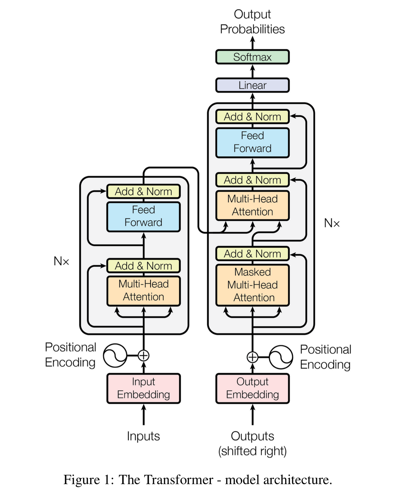
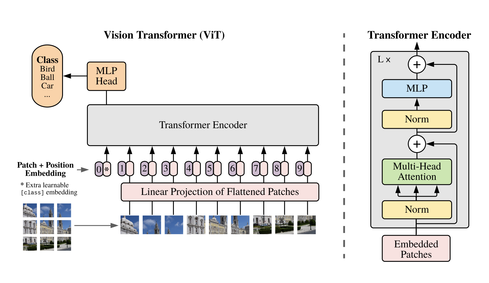

# 🧠 Transformer from Scratch & Vision Transformer (ViT) on MNIST

Welcome! This repo contains a **full transformer implementation** (encoder-decoder, as in the original "Attention is All You Need" paper) and a Vision Transformer (ViT) for MNIST digit classification, both built from scratch in PyTorch.  
Explore, learn, and experiment with modern attention-based architectures!

---

## 📦 Folder Structure

```
transformer/
├── Transformer.py      # Full transformer (encoder-decoder) implementation
├── vit.ipynb           # Vision Transformer notebook for MNIST
├── images/             # Architecture diagrams & attention visualizations
│   ├── transformer_architecture.png
│   ├── self_attention.png
│   ├── vit_patch_embedding.png
│   └── ... (add more as needed)
└── README.md           # You're here!
```

---

## 🚀 What’s Inside?

### 1. **Transformer.py**

A faithful, readable PyTorch implementation of the original transformer:

- **Multi-Head Self Attention**: Parallel attention heads for richer representations.
- **Encoder & Decoder Blocks**: LayerNorm, residuals, feedforward, masking.
- **Positional Embedding**: Adds order info to sequences.
- **Source & Target Masking**: Handles padding and causal decoding.
- **Test Section**: Try it out with toy data!

### 2. **Vision Transformer (ViT) Notebook**

- Splits MNIST images into patches.
- Embeds patches, applies transformer blocks, and classifies digits.
- Plots training loss and accuracy.
- Runs fast on Mac (MPS/Metal), CUDA, or CPU.

---

## 🖼️ Architecture Visuals

Want to see how it works?  
Check out these diagrams in the `images/` folder:

| Diagram                                                          | Description                                                                                                            |
| ---------------------------------------------------------------- | ---------------------------------------------------------------------------------------------------------------------- |
|  | **Full Transformer Encoder-Decoder**: Shows the flow from input to output, with attention layers and skip connections. |
|                      | **Multi-Head Self Attention**: Visualizes how each token attends to every other token.                                 |
|            | **ViT Patch Embedding**: How images are split into patches and embedded for transformer input.                         |

---

## 🤔 How Does a Transformer Work?

- **Attention**: Each token can "look at" every other token, learning relationships regardless of distance.
- **Multi-Head**: Multiple attention heads let the model learn different types of relationships in parallel.
- **Encoder**: Processes the input sequence, building deep contextual representations.
- **Decoder**: Generates output, attending to both previous outputs and the encoder’s memory.
- **No Recurrence or Convolution**: Everything is parallelized for speed and scalability.

### Why is this cool?

- Handles long-range dependencies better than RNNs/CNNs.
- Powers state-of-the-art models in NLP, vision, and science.

---

## 🏃‍♂️ Quickstart

**Install dependencies:**

```bash
pip install torch torchvision matplotlib
```

**Run the Vision Transformer notebook:**

- Open `vit.ipynb` in Jupyter or VS Code.
- Run all cells to train ViT on MNIST and see results.

**Try the full transformer:**

- Explore `Transformer.py` for the encoder-decoder implementation.
- Adapt it for your own sequence tasks (translation, forecasting, etc.).

---

## 📊 Results

- **ViT on MNIST**: Achieves strong accuracy after just a few epochs.
- **Training curves**: See loss and accuracy plots in the notebook.
- **Modular code**: Easy to extend for deeper models, more epochs, or other datasets.

---

## 💬 Interactive Exploration

- Play with hyperparameters in the notebook (patch size, depth, heads).
- Swap out images in the `images/` folder to visualize different concepts.
- Add your own experiments and share results!

---

## 📚 References

- [Attention is All You Need (Vaswani et al., 2017)](https://arxiv.org/abs/1706.03762)
- [An Image is Worth 16x16 Words (Dosovitskiy et al., 2020)](https://arxiv.org/abs/2010.11929)

---

## 🙌 Contributing & Feedback

Questions, suggestions, or want to add your own diagrams?  
Open an issue or pull request—everyone’s welcome!

---

**Happy experimenting! 🚀**
