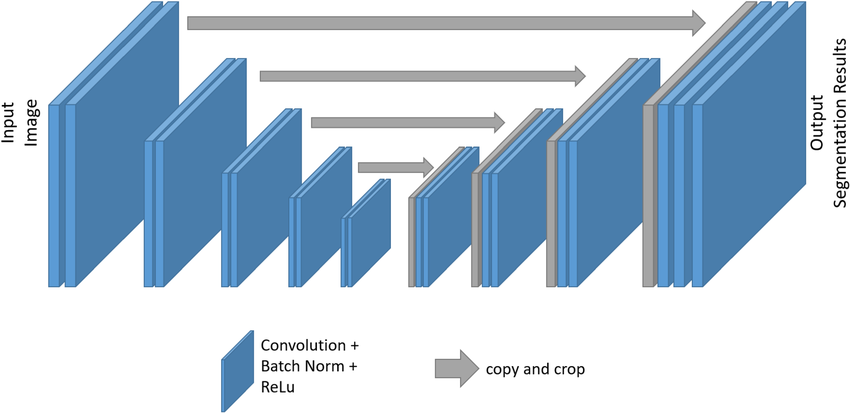

# 🧬 UNet: Original Paper Implementation & MNIST Classification

Welcome to the UNet playground!  
This repo contains a **faithful, from-scratch PyTorch implementation of the original UNet architecture** (Ronneberger et al., 2015) and a notebook showing how to adapt UNet for MNIST digit classification.  
Whether you’re interested in biomedical segmentation or creative uses like image classification, you’ll find code, explanations, and visuals here.

---

## 📦 Folder Structure

```
unet/
├── unet.py                # UNet model (original paper style)
├── unet_msist.ipynb       # UNet for MNIST classification notebook
├── images/                # Architecture diagrams & visualizations
│   ├── unet_architecture.png
│   ├── unet_skip_connections.png
│   └── ... (add more as needed)
└── README.md              # You're here!
```

---

## 🖼️ UNet Architecture Visuals

| Diagram                                               | Description                                                                                                                           |
| ----------------------------------------------------- | ------------------------------------------------------------------------------------------------------------------------------------- |
|     | **UNet Encoder-Decoder:** Shows the contracting (downsampling) and expanding (upsampling) paths, with skip connections.               |
|  | **Skip Connections:** Visualizes how features from the encoder are copied and concatenated into the decoder for precise localization. |

Feel free to add more images—segmentation outputs, feature maps, or your own sketches!

---

## 🤔 What is UNet?

UNet is a convolutional neural network designed for **biomedical image segmentation**.  
Its key innovation is the **U-shaped architecture**:

- **Encoder (Contracting Path):**

  - Repeated blocks of two convolutions + ReLU, followed by max pooling.
  - Each block doubles the number of feature channels.
  - Purpose: Capture context and compress spatial information.

- **Decoder (Expanding Path):**

  - Upsampling via transposed convolutions.
  - Each block halves the number of channels.
  - **Skip Connections:** Features from the encoder are cropped and concatenated to the decoder, preserving fine details lost during downsampling.

- **Final Output:**
  - A 1x1 convolution maps features to the desired number of output channels (e.g., segmentation masks).

**Why is UNet special?**

- Works with very little training data.
- Excels at precise localization (e.g., cell boundaries).
- The skip connections let it combine global context with local detail.

---

## 🛠️ Implementation Details

- **double_conv:** Two consecutive 3x3 convolutions + ReLU.
- **crop_img:** Crops encoder features to match decoder size before concatenation (important for odd-sized inputs).
- **Encoder:** Five downsampling blocks, each doubling channels.
- **Decoder:** Four upsampling blocks, each halving channels, with skip connections.
- **Output Layer:** 1x1 convolution for segmentation (can be adapted for classification).

**Original Paper Reference:**  
Ronneberger et al., 2015 — [U-Net: Convolutional Networks for Biomedical Image Segmentation](https://arxiv.org/abs/1505.04597)

---

## 🏃‍♂️ Quickstart

**Install dependencies:**

```bash
pip install torch torchvision matplotlib
```

**Try the original UNet:**

- See `unet.py` for the full model.
- Test with random input or adapt for your own segmentation data.

**MNIST Classification Notebook:**

- Open `unet_msist.ipynb` in Jupyter or VS Code.
- Trains UNet as a feature extractor + classifier (using global average pooling and a linear layer).
- Plots training loss and accuracy.

---

## 📊 Results

- **MNIST Classification:**

  - UNet achieves strong accuracy even though it’s designed for segmentation.
  - Shows the flexibility of the architecture for different tasks.

- **Segmentation (if you add your own data):**
  - UNet can segment objects with high precision, especially in biomedical images.

---

## 💬 Interactive Exploration

- Play with the number of layers, channels, or input size in `unet.py`.
- Visualize feature maps or segmentation outputs (add images to `images/`).
- Try UNet on other datasets—fashion MNIST, medical images, etc.

---

## 📚 References

- [U-Net: Convolutional Networks for Biomedical Image Segmentation (Ronneberger et al., 2015)](https://arxiv.org/abs/1505.04597)

---

## 🙌 Contributing & Feedback

Questions, suggestions, or want to add your own diagrams?  
Open an issue or pull request—everyone’s welcome!

---

**Happy segmenting and classifying! 🧬🖼️**
