# 🌍 FuXi-Weather: Transformer Pipeline for Global Weather Forecasting

[](https://www.python.org/)
[](https://pytorch.org/)
[](LICENSE)
[](#)

---
🔗  Updated Version Available:
A cleaner, modular, and cluster-ready version of this project is available here:
👉 https://github.com/Artamta/Fuxi-Updated-V2

---

## 📝 Project Overview

This repository contains my semester project at IISER Pune: a compact, FuXi-inspired deep learning pipeline for global weather forecasting using Cube Embedding → Swin Transformer V2 → U-Net decoder.

**Goal:** Build a strong foundation model for ERA5/WeatherBench2 and extend it into a full FuXi-style autoregressive cascade.

---

## 📌 Highlights

- **Dataset:** WeatherBench2 (ERA5), global reanalysis at 64×32 resolution
- **Task:** Single-step 6-hour prediction
- **Inputs:** Two consecutive timesteps → 20 variables
- **Architecture:**
  - Cube Embedding (3D Conv)
  - Swin Transformer V2 Encoder
  - U-Net Decoder with skip connections
  - 1×1 projection + bilinear interpolation
- **Training:** AdamW, AMP, cosine LR, early stopping
- **Hardware:** NVIDIA A100 (HPC cluster, Slurm)

---

## 📂 Repository Structure

```
Fuxi-Weather-Prediction/
├── models/
├── scripts/
├── configs/
├── utils/
├── results/        # All plots and outputs here
├── data/
└── README.md
```

---

## 🧠 Architecture Overview

<p align="center">
  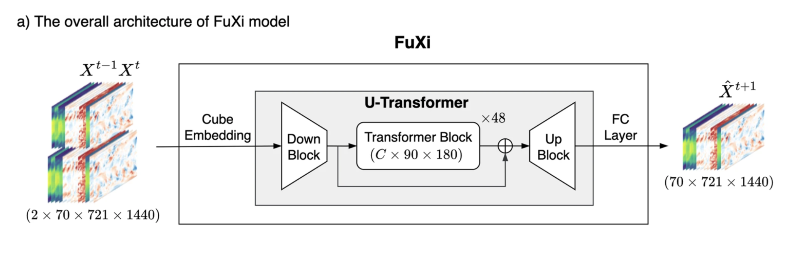
</p>

**Data Flow:**

```
Input (B, C=20, T=2, H=32, W=64)
   ↓
Cube Embedding (3D Conv)
   ↓
Swin Transformer V2 Encoder
   ↓
U-Net Decoder (skip connections)
   ↓
1×1 Conv → Bilinear Interpolation
   ↓
Output: Next 6-hour forecast
```

**Components:**

| Component        | Image                                     |
| ---------------- | ----------------------------------------- |
| Cube Embedding   | 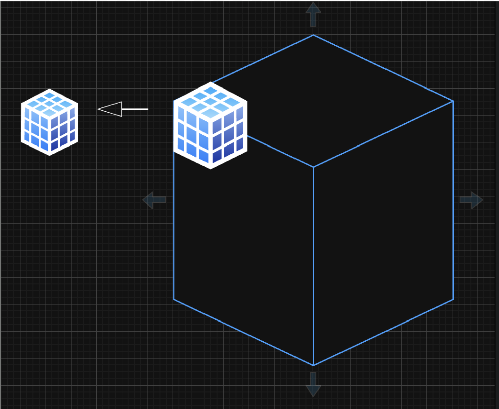 |
| Swin Transformer | 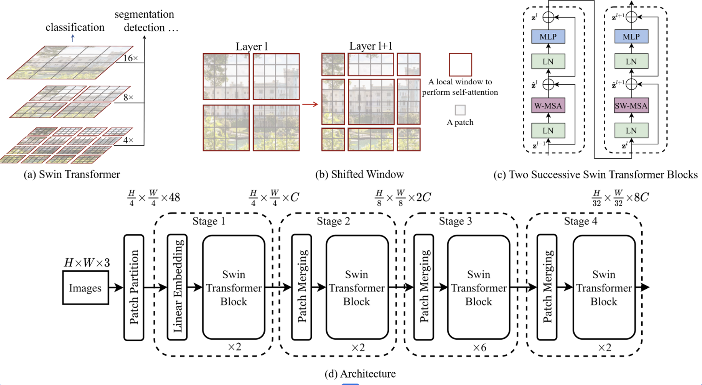 |
| U-Net Decoder    | 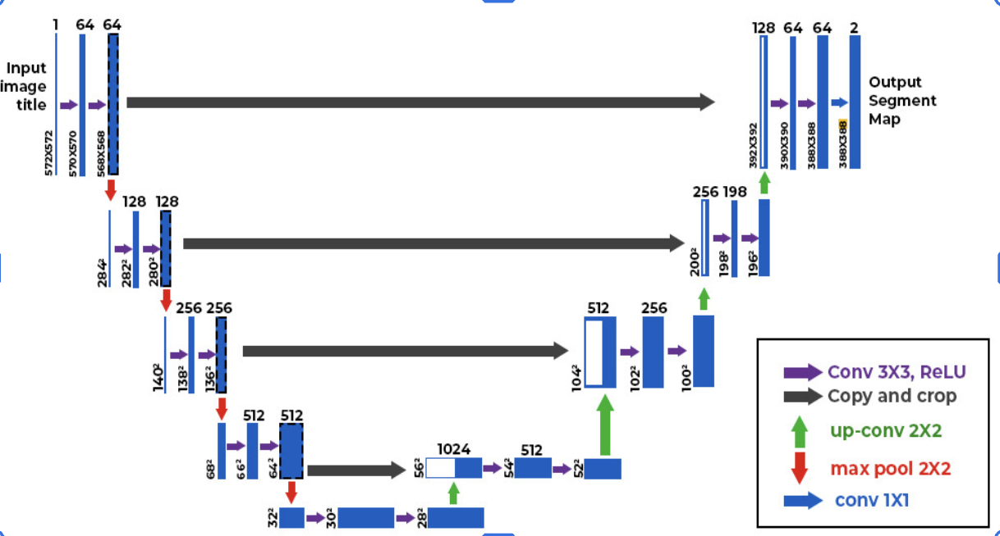 |

---

## ⚙️ Foundation Model Hyperparameters

| Setting         | Value                             |
| --------------- | --------------------------------- |
| Experiment name | FuXi3Stage_20251118_005002        |
| Train/Val/Test  | 1959–2017 / 2018–2020 / 2021–2023 |
| Resolution      | 64 × 32                           |
| History steps   | 2                                 |
| Input channels  | 20                                |
| Batch size      | 2 (OOM limit on A100)             |
| Optimizer       | AdamW                             |
| LR              | 1.5e-4                            |
| Weight decay    | 0.02                              |
| Swin dims       | (512, 768, 960)                   |
| Swin depths     | (3, 4, 6)                         |
| Swin heads      | (8, 12, 15)                       |
| Window size     | 8                                 |
| Drop path       | 0.15                              |
| AMP             | Enabled                           |

---

## 📊 Results

### Target vs Prediction (6-panel)

<p align="center">
  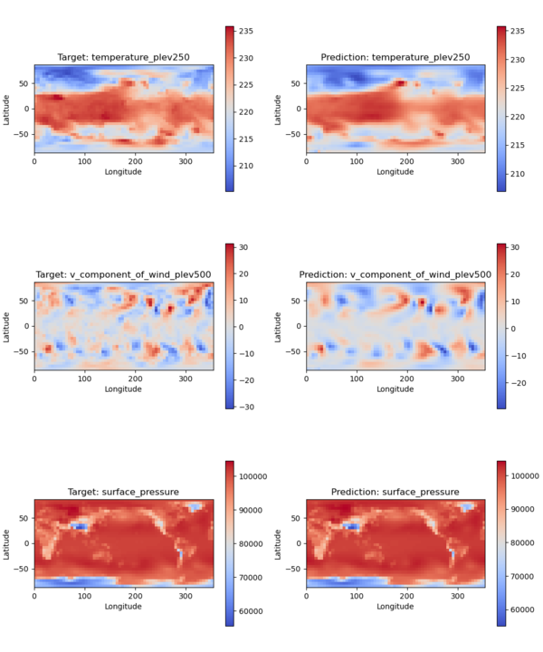
</p>

### Scatter Plots (250, 500, 850 hPa)

<p align="center">
  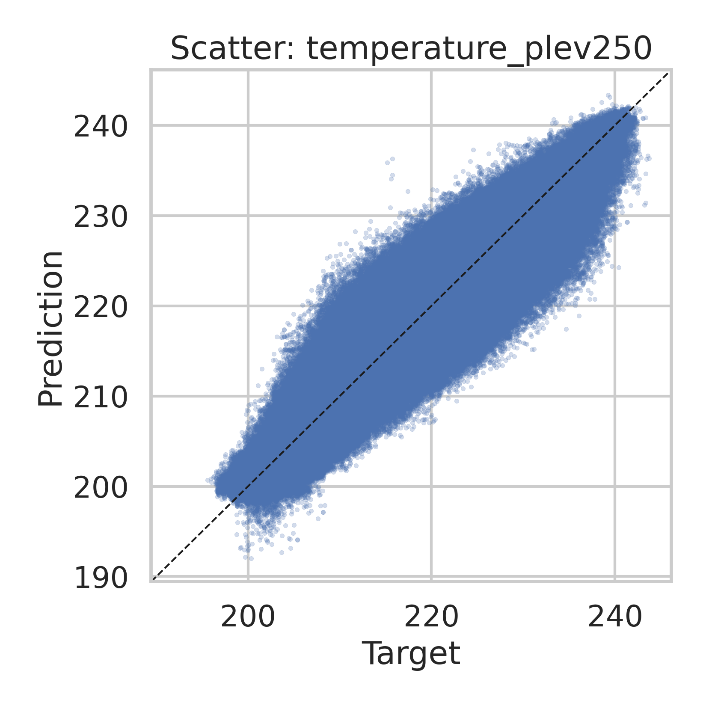
  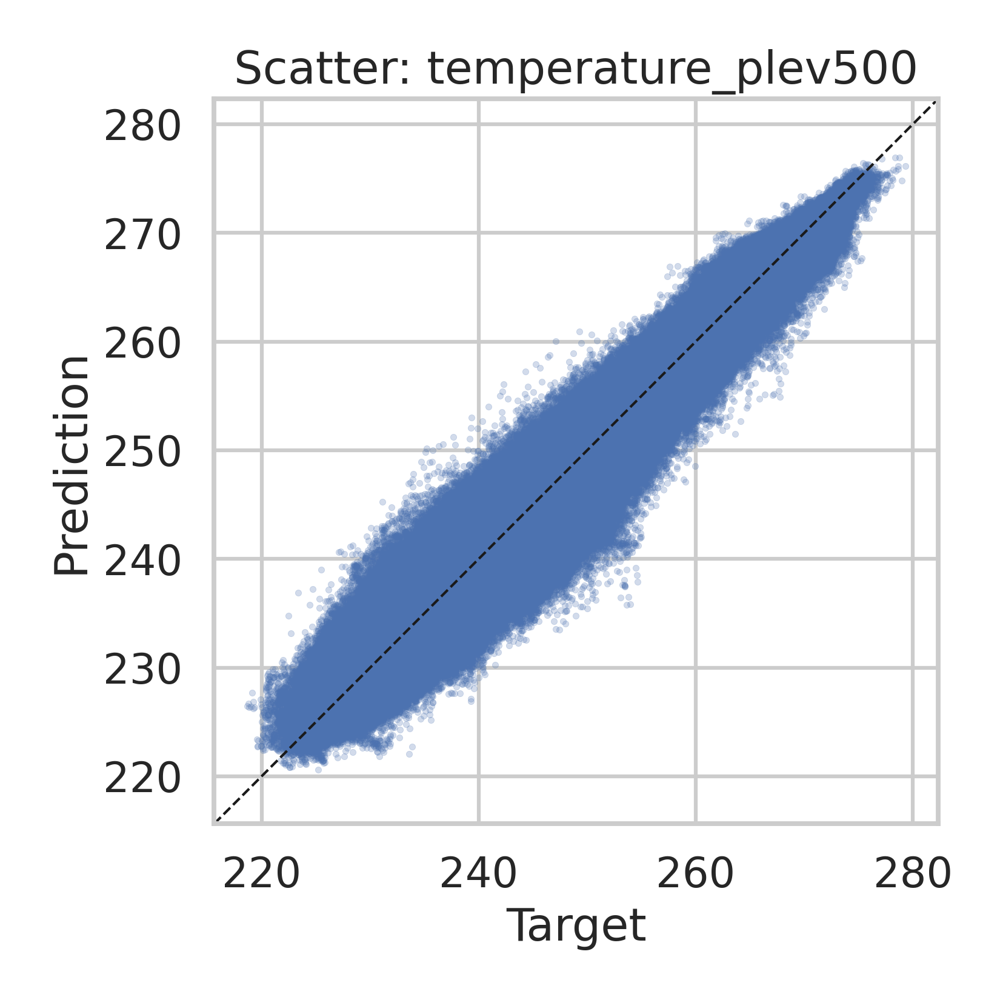
  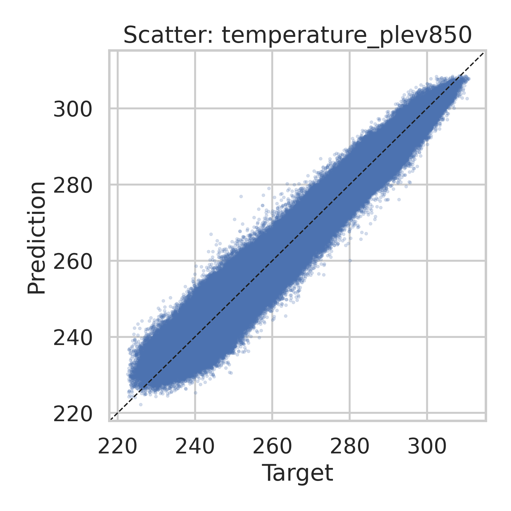
</p>

### Temporal RMSE & Latitude Error

<p align="center">
  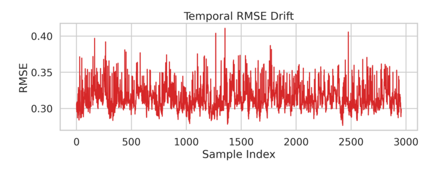
  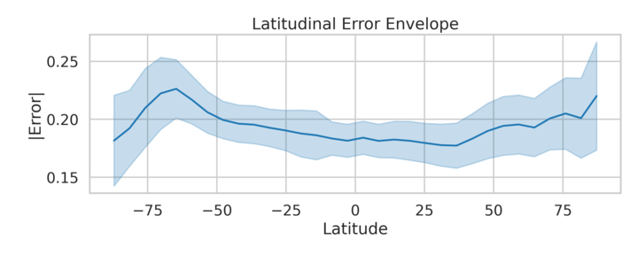
</p>

### Training Loss & Per-variable Error

<p align="center">
  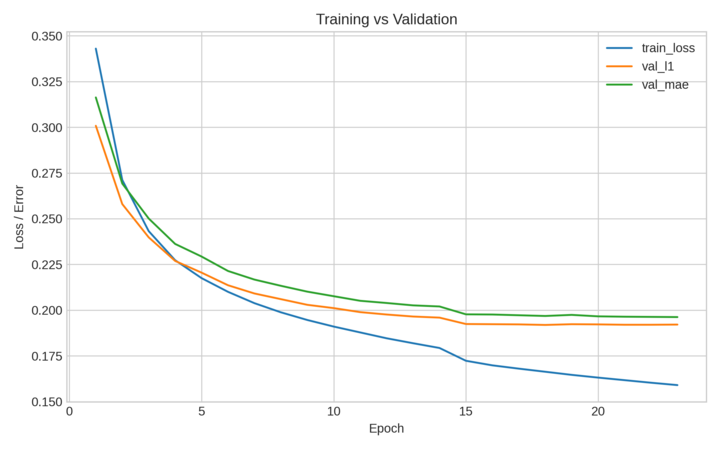
  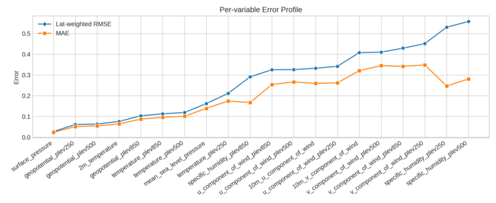
</p>

---

## ⚠️ Challenges: Depth vs Resolution

- Low-resolution inputs (64×32) → weak gradients, so deep Swin stacks collapse to constant outputs.
- **Observed issues:**
  - Loss of fine-scale structure
  - Vanishing gradients across deep attention layers
  - High memory usage → batch size extremely small (2)
- **Mitigation:**
  - Moderate Swin depth
  - Use convolutional inductive biases
  - Warm-start + AMP
  - Increase resolution (1°, 0.25°) for future work

---

## 📈 Future Work — FuXi Autoregressive Cascade

<p align="center">
  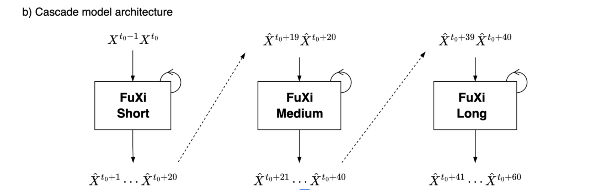
</p>

**Planned pipeline:**

- Model 1: Short-range (0–5 days)
- Model 2: Medium-range (5–10 days)
- Model 3: Long-range (10–15 days)
- With Perlin-noise perturbations for stochastic ensembles

---

## 🚀 Quickstart

**1. Clone repo**

```bash
git clone https://github.com/Artamta/Fuxi-Weather-Prediction.git
cd Fuxi-Weather-Prediction
```

**2. Install dependencies**

```bash
conda create -n fuxi python=3.10 -y
conda activate fuxi
pip install -r requirements.txt
```

**3. Train**

```bash
python scripts/train.py --config configs/default.yaml
```

**4. Evaluate**

```bash
python scripts/evaluate.py --checkpoint results/best_model.pth
```

**5. Slurm (HPC)**

```bash
sbatch scripts/slurm_train.sh
```

---

## 📚 References

- Chen et al. 2023 — FuXi: A cascade ML weather forecasting system
- Rasp et al. 2023 — WeatherBench2
- Liu et al. 2021 — Swin Transformer
- Ronneberger et al. — U-Net

---

## 💬 Contact

Ayush Raj  
IISER Pune, Department of Data Science  
📧 ayush.raj@students.iiserpune.ac.in  
🔗 [GitHub: Artamta/Fuxi-Weather-Prediction](https://github.com/Artamta/Fuxi-Weather-Prediction)

---

_This repository is under active development — contributions and feedback are welcome!_
